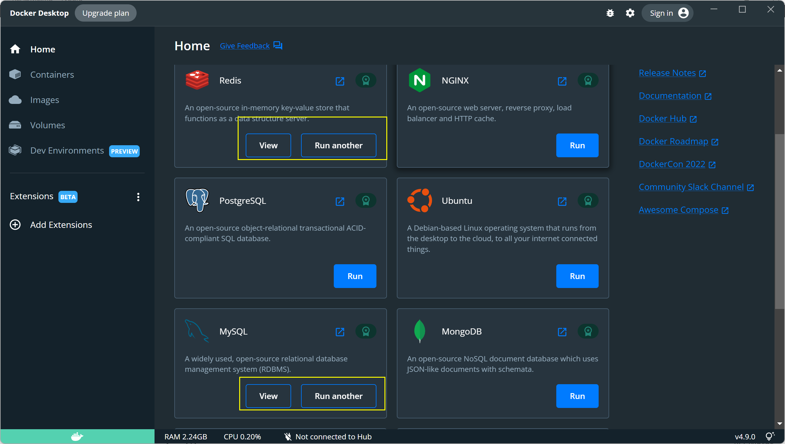
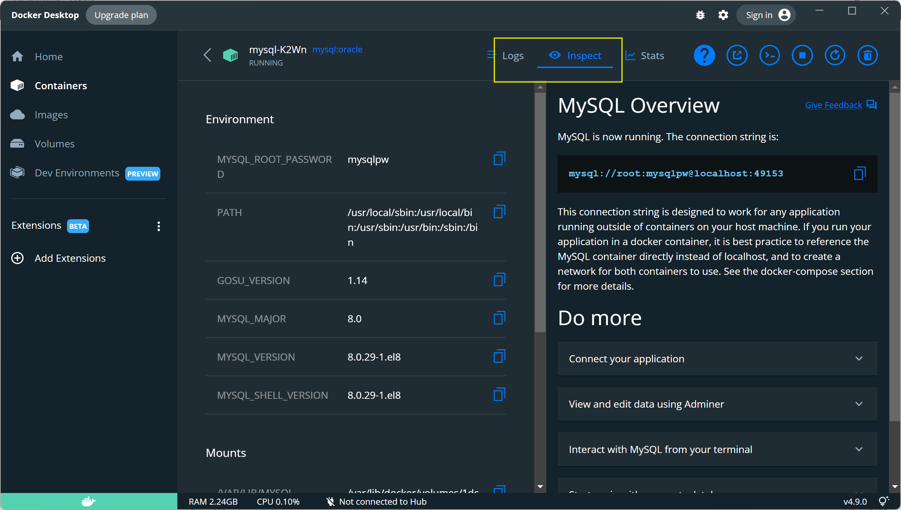

# 智慧校园考试系统

这是以[codeAmberKo/exam_system: Python课程设计](https://github.com/codeAmberKo/exam_system)为Baseline进行的改进设计


## 系统环境

MySQL 8.0

Redis 7.0.0

Django版本2.1.4

python 3.8.3


## 安装步骤

### MySQL

法一（原仓库）：

- cd 到mysql/bin目录下 
- 执行以下命令连接数据库
- mysql -uroot -p 
- 输入密码
- 创建数据库：
- Create database exam_system default character set utf8;

法二（docker）：

在docker上点击RUN配置对应的MySQL与Redis。




安装后点View 可以看到对应的数据库信息：



在terminal启动数据库

```python
docker exec -it mysql-K2Wn mysql -pmysqlpw
```

按照此博客重新配设置密码：

[(11条消息) 使用Docker配置MySQL_LOONGSE的博客-CSDN博客_docker配置mysql](https://blog.csdn.net/qq_41629142/article/details/106936034)

到这个语句即可：

> select host,user,plugin,authentication_string from mysql.user;

在pycharm中连接数据库并创建

```
Create database exam_system default character set utf8;
```


### Django

- 使用pip install Django==2.1.4 进行安装。

### 安装虚拟环境

- 运行以下命令

```pip install virtualenv```

- cd 到Exam\venv\Scripts中 运行

```activate```


我是直接纸执行如下命令。。。
- pip install -r requirements.txt


然后回到Exam根目录安装项目所需安装包

### 连接数据库

-  迁移数据库，创建数据表

  ```
  python manage.py migrate
  ```

- 继续运行：

  ```
  python manage.py runserver
  ```

- 启动项目，然后，访问“http://127.0.0.1:8000”


### 注：

- 配置文件位于config/local_settings.py 以及 config/settings.py

- 收到邮件，由于我们在本地测试，不能直接单击邮箱验证链接，可以手动赋值链接，然后在链接地址前添加“http://127.0.0.1:8000"


### Superuser 

创建superuser:
```python
python manage.py createsuperuser
```
进入http://127.0.0.1:8000/admin/

在`可认证企业`中添加可认证企业邮箱，之后即可注册相关邮箱。
进入相关admin的时候可能会出现csrf校验失败问题，可以试试重复开几次http://127.0.0.1:8000/，然后刷新http://127.0.0.1:8000/admin即可


## Fix bug

- 成为机构后设置密码出错
- 修改密码出错
- 由于版本问题的redis连接问题
- 无法交卷
- 注册验证码无法点击刷新
- 等等

## 队员
Chan  &&  夏日

./doc/ 中有答辩PPT 以及2万字的文档

验收老师：刘洪波、折建章、唐麟

如果是跟我们同一个老师的同学就不要用这个项目了，毕竟应该也算留下深刻的印象吧。

当然，部分内容还是有些问题，比如表格的设定啥的，还是需要你们接着完善。

只求一个star
